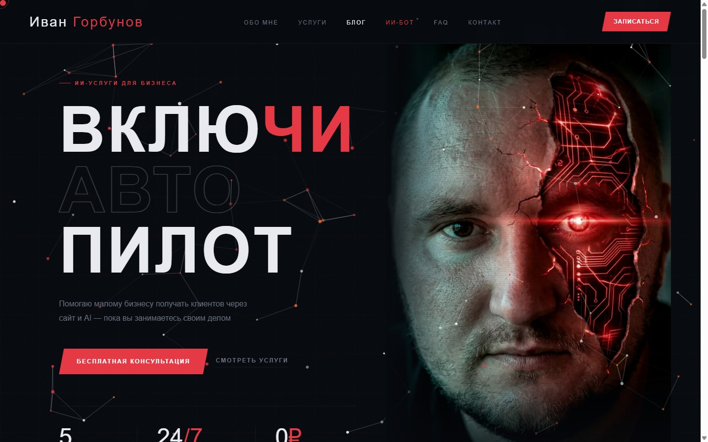
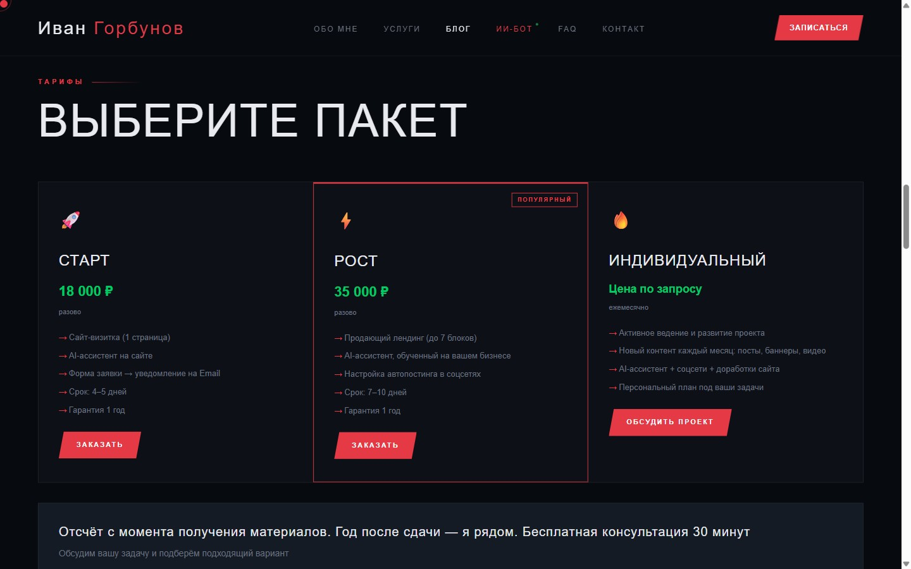
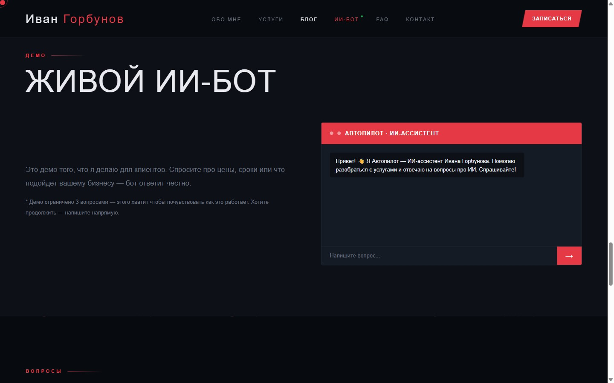
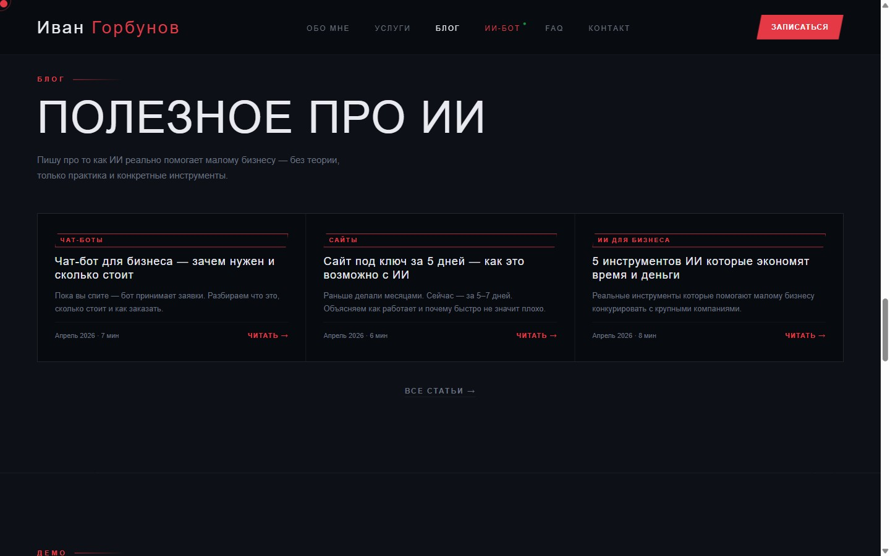

# AI Brand Engine — автоматизированная система личного бренда

> Живой сайт: **[автопилот24.рф](https://автопилот24.рф)**

Персональный сайт AI-специалиста по автоматизации малого бизнеса. Сам сайт является демо услуг — клиент видит работающего AI-ассистента, читает блог и сразу понимает что получит.



---

## Проблема

Эксперт по AI-автоматизации не может показать свою работу текстом — нужно дать потрогать. Стандартные лендинги теряют клиента: он читает «делаю AI-ботов» и не понимает как это работает. Решение — сайт-демо где AI-ассистент отвечает прямо на странице, а блог показывает экспертизу в действии.

---

## Для кого

ИП и фрилансеры в нише AI-автоматизации и веб-разработки. Также — шаблон для любого эксперта который хочет привлекать клиентов через работающее демо своих услуг.

---

## Что делает

**Пользователь заходит на сайт →** видит услуги и тарифы → задаёт вопрос живому AI-боту → получает ответ про цены и сроки → оставляет заявку.

### Ключевые функции

| Функция | Описание |
|---------|----------|
| AI-ассистент | Отвечает на вопросы об услугах и тарифах 24/7, защищён от prompt injection |
| Блог | 3 статьи про AI для бизнеса, schema.org, перекрёстные ссылки |
| Тарифы | 3 пакета (СТАРТ 18к, РОСТ 35к, ИНДИВИДУАЛЬНЫЙ) |
| Форма заявки | Сбор обращений через контактную форму |
| Адаптив | Полностью адаптирован под мобильные устройства |



---

## AI-ассистент (изюминка проекта)

Живой бот прямо на сайте — демо того, что клиент получит в своём проекте.

**Технические детали:**
- Движок: GigaChat API (Sberbank) — российский, соответствует требованиям
- System prompt на сервере (не виден в DevTools)
- Защита от атак: rate limiting (15 req/min), фильтр prompt injection (15+ паттернов EN+RU)
- Форматирование ответов: markdown-like рендеринг
- После 3 вопросов — CTA кнопка «Написать в Telegram»



---

## Блог



- 3 статьи: чат-боты, сайт за 5 дней с AI, 5 инструментов AI для бизнеса
- schema.org BlogPosting — Google распознаёт как статьи
- Блок «Читайте также» между статьями
- Шаблон `blog-template.html` с плейсхолдерами для автопостинга через n8n

---

## Мобильная версия


---

## Технологии

- **Frontend:** HTML5, CSS3 (CSS Variables, Grid, Flexbox), Vanilla JS
- **Backend:** Node.js (http module, без фреймворков)
- **AI:** GigaChat API (Sberbank) — российский LLM
- **Эффекты:** tsParticles (интерактивные частицы в hero)
- **Деплой:** VPS сервер РФ, PM2, Nginx reverse proxy, SSL

---

## Структура репозитория

```
autopilot-site/
├── public/
│   ├── index.html          # Главная страница
│   ├── blog.html           # Список статей
│   ├── blog-article1.html  # Чат-боты для бизнеса
│   ├── blog-article2.html  # Сайт за 5 дней с AI
│   ├── blog-article3.html  # 5 инструментов AI
│   ├── blog-template.html  # Шаблон для автопостинга (n8n)
│   ├── hero-photo.webp     # Фото для hero-секции
│   ├── about-photo.webp    # Фото для секции «Обо мне»
│   └── images/             # Изображения блога и OG
├── server.js               # Node.js сервер + GigaChat API
├── robots.txt
├── sitemap.xml
├── .env.example            # Шаблон переменных окружения
└── .gitignore
```

---

## Как запустить локально

### 1. Клонировать репозиторий

```bash
git clone https://github.com/ivangorbunov806-a11y/autopilot-site.git
cd autopilot-site
```

### 2. Настроить переменные окружения

```bash
cp .env.example .env
# Вставить GIGA_AUTH из https://developers.sber.ru/portal/products/gigachat
```

### 3. Запустить сервер

```bash
node server.js
# Сайт доступен на http://localhost:8080
```

> Без `GIGA_AUTH` сайт открывается, но AI-ассистент вернёт ошибку. Для просмотра без бота файлы из `public/` можно открыть напрямую в браузере.

---

## Что планируется дальше

- **Серверная отправка формы** — сохранение заявок в `leads.json` + email-уведомление через Yandex SMTP
- **Политика конфиденциальности** — соответствие 152-ФЗ, чекбокс согласия в форме
- **Автопостинг через n8n** — генерация статей в блог по расписанию
- **AI-аватар** — видео с аватаром для YouTube Shorts / Telegram
- **Мультиплатформа** — VK, LinkedIn, Telegram-канал

---

## Автор

**Иван Горбунов** — AI-специалист, автоматизация малого бизнеса  
Telegram: [@ivangorbunov_pro](https://t.me/ivangorbunov_pro)  
Сайт: [автопилот24.рф](https://автопилот24.рф)
